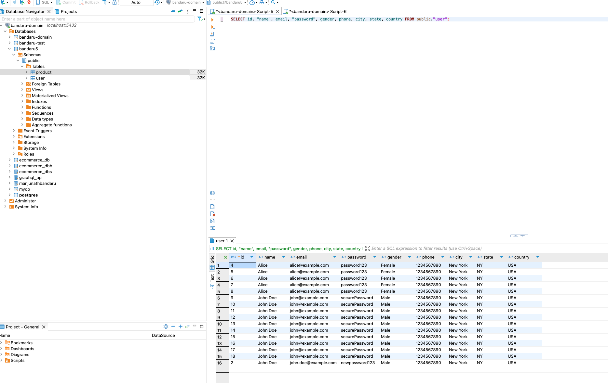

# bandaru5-backend

queries:

#User

#Product

mutation {
  createProduct(input: {
    name: "Product Name",
    description: "Product Description",
    price: 29.99,
    sku: "PRODUCT-12345",
    categoryId: 1,
    inventoryId: 101,
    discountId: 10,
    imageUrl: "http://example.com/product-image.jpg"
  }) {
    id
    name
    description
    price
    sku
    categoryId
    inventoryId
    discountId
    createdAt
    modifiedAt
    imageUrl
  }
}

query GetAllProducts {
  products {
    id
    name
    description
    price
    sku
    categoryId
    inventoryId
    discountId
    createdAt
    modifiedAt
    imageUrl
  }
}

mutation UpdateProduct {
  updateProduct(
    id: 1, 
    input: {
      name: "Updated Product Name",
      description: "Updated description for the product.",
      price: 199.99,
      sku: "UPD-001",
      categoryId: 2,
      inventoryId: 5,
      discountId: 3,
      imageUrl: "https://example.com/new-image.jpg"
    }
  ) {
    id
    name
    description
    price
    sku
    categoryId
    inventoryId
    discountId
    imageUrl
    createdAt
    modifiedAt
  }
}

mutation DeleteProduct {
  deleteProduct(id: 1)
}

#Database

#Sources

https://fabric.inc/blog/commerce/ecommerce-database-design-example